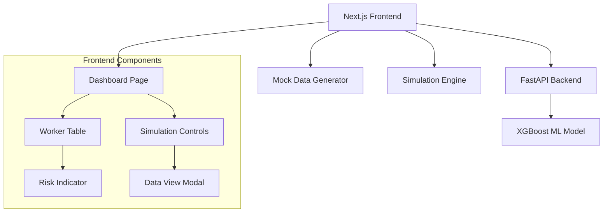

# Design Document

## Overview

The Worker Health Dashboard is a Next.js React application that provides real-time monitoring of worker health metrics through integration with an existing FastAPI ML backend. The system displays worker health data in a professional table format with color-coded risk indicators and includes simulation capabilities for demonstration purposes.

## Architecture

### System Components



### Technology Stack

- **Frontend**: Next.js 15.5.3 with React 19.1.0, TypeScript, Tailwind CSS
- **Backend**: FastAPI (existing) with XGBoost model
- **Styling**: Tailwind CSS for professional dashboard appearance
- **State Management**: React hooks for local state management
- **HTTP Client**: Fetch API for backend communication

## Components and Interfaces

### Frontend Components

#### 1. Dashboard Page (`app/page.tsx`)
- Main container component
- Manages global state for workers and simulation
- Handles backend API calls
- Coordinates between table and simulation controls

#### 2. WorkerTable Component
- Displays tabular data for all workers
- Renders risk indicators with color coding
- Updates in real-time during simulations
- Responsive design for professional appearance

#### 3. RiskIndicator Component
- Visual representation of risk score (0.0 - 1.0)
- Color interpolation from green (#10B981) to red (#EF4444)
- Displays numeric risk score alongside color indicator

#### 4. SimulationControls Component
- "Simulate Heat Up" and "Cool Down" buttons
- "View" button to show current simulation values
- Start/stop simulation functionality
- Targets "John Doe" worker specifically

#### 5. DataViewModal Component
- Modal overlay showing current simulation values
- Displays all 55 features being sent to backend
- Real-time updates during simulation
- Close/dismiss functionality

### Data Models

#### Worker Interface
```typescript
interface Worker {
  id: string;
  name: string;
  gender: number;
  age: number;
  // HRV metrics (51 fields)
  hrv_mean_nni: number;
  hrv_median_nni: number;
  hrv_range_nni: number;
  // ... (all 51 HRV fields)
  temperature: number;
  humidity: number;
  riskScore?: number;
  predictedClass?: string;
  confidence?: number;
}
```

#### Backend Response Interface
```typescript
interface PredictionResponse {
  risk_score: number;
  predicted_class: string;
  confidence: number;
}
```

#### Simulation State Interface
```typescript
interface SimulationState {
  isActive: boolean;
  type: 'heatup' | 'cooldown' | null;
  targetWorker: string;
  currentValues: Partial<Worker>;
  intervalId?: NodeJS.Timeout;
}
```

### API Integration

#### Backend Endpoint
- **URL**: `http://localhost:8000/predict`
- **Method**: POST
- **Content-Type**: application/json
- **Request Body**: All 55 worker features
- **Response**: `PredictionResponse` object

#### Error Handling
- Network errors: Display user-friendly error messages
- Backend unavailable: Show offline indicator
- Invalid responses: Log errors and use fallback values

## Data Models

### Feature Set (55 total features)
1. **Demographics**: Gender, Age
2. **HRV Time Domain** (13): mean_nni, median_nni, range_nni, sdsd, rmssd, nni_50, pnni_50, nni_20, pnni_20, cvsd, sdnn, cvnni
3. **HRV Frequency Domain** (8): mean_hr, min_hr, max_hr, std_hr, total_power, vlf, lf, hf, lf_hf_ratio, lfnu, hfnu
4. **HRV Geometric** (6): SD1, SD2, SD2SD1, CSI, CVI, CSI_Modified
5. **HRV Statistical** (21): mean, std, min, max, ptp, sum, energy, skewness, kurtosis, peaks, rms, lineintegral, n_above_mean, n_below_mean, n_sign_changes, iqr, iqr_5_95, pct_5, pct_95, entropy, perm_entropy, svd_entropy
6. **Environmental** (2): Temperature, Humidity

### Mock Data Generation
- Generate 8-12 workers with random names
- Use realistic ranges for each feature type
- Ensure "John Doe" is always included for simulation
- Baseline values that produce varied but reasonable risk scores

### Risk Score Color Mapping
- **0.0 - 0.2**: Green (#10B981)
- **0.2 - 0.4**: Yellow-Green (#84CC16)
- **0.4 - 0.6**: Yellow (#EAB308)
- **0.6 - 0.8**: Orange (#F97316)
- **0.8 - 1.0**: Red (#EF4444)

## Error Handling

### Frontend Error Handling
1. **API Errors**: Display toast notifications for failed requests
2. **Network Issues**: Show connection status indicator
3. **Invalid Data**: Use fallback values and log warnings
4. **Simulation Errors**: Stop simulation and show error message

### Backend Integration
1. **Missing Features**: Backend fills missing values with 0.0
2. **Invalid Responses**: Frontend validates response structure
3. **Timeout Handling**: 10-second timeout for API calls

## Testing Strategy

### Unit Testing Approach
1. **Component Testing**: Test individual React components
2. **API Integration**: Mock backend responses for testing
3. **Simulation Logic**: Test heat up/cool down algorithms
4. **Color Calculation**: Verify risk score to color mapping

### Manual Testing Scenarios
1. **Dashboard Load**: Verify initial data display
2. **Risk Indicators**: Confirm color coding accuracy
3. **Heat Up Simulation**: Test progressive risk increase
4. **Cool Down Simulation**: Test progressive risk decrease
5. **Data View Modal**: Verify simulation value display
6. **Backend Integration**: Test with actual ML model

### Performance Considerations
1. **Simulation Intervals**: 2-second intervals for smooth updates
2. **API Throttling**: Prevent excessive backend calls
3. **Memory Management**: Clean up intervals on component unmount
4. **Responsive Design**: Ensure table works on different screen sizes

## Implementation Notes

### Simulation Algorithm
- **Heat Up**: Gradually increase Temperature (0.5°C increments) and Humidity (2% increments)
- **Cool Down**: Gradually decrease Temperature and Humidity at same rates
- **Duration**: 30-60 seconds for full simulation cycle
- **Updates**: Every 2 seconds with backend API call

### Professional Dashboard Design
- Clean, minimal interface with focus on data clarity
- Consistent spacing and typography using Tailwind CSS
- Intuitive color coding for risk assessment
- Responsive table design for various screen sizes
- Professional color palette suitable for business environment