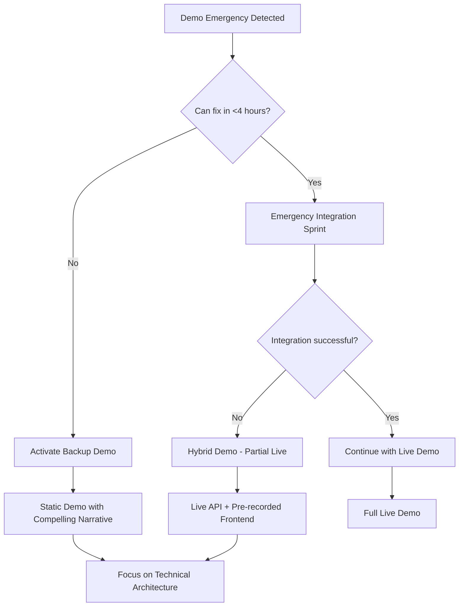

# **HeatGuard Pro - Emergency Coordination Protocols**
## **Safety-Critical Emergency Response Framework**

---

## **⚠️ SAFETY-CRITICAL CONTEXT**

HeatGuard Pro is a **life-safety system** preventing heat stroke and workplace injuries. Emergency protocols must account for:

- **Life Safety Impact:** System failures could lead to missed heat emergencies
- **Regulatory Compliance:** OSHA requirements for worker safety monitoring
- **Real-Time Requirements:** Prediction delays >1 minute could miss critical interventions
- **Demo Stakes:** System must demonstrate reliability for investor/customer confidence

---

## **🚨 Emergency Classification System**

### **Code Red - System Failure (Life Safety Impact)**
**Criteria:**
- Safety alert system completely non-functional
- ML prediction model returning invalid/dangerous results (false negatives)
- API down for >15 minutes during operational hours
- Dashboard showing incorrect risk levels or missing critical workers

**Response Time:** **IMMEDIATE (<5 minutes)**

**Emergency Team Assembly:**
```bash
# IMMEDIATE RESPONSE PROTOCOL
1. Spawn emergency-safety-specialist (full tool access)
2. Alert all active subagents to code red status
3. Activate backup safety monitoring systems
4. Implement manual safety override procedures

# Emergency Specialist System Prompt:
"CODE RED SAFETY EMERGENCY: HeatGuard Pro safety-critical failure detected.
Your mission: Restore safety monitoring capability within 30 minutes using any means necessary.
Lives depend on accurate heat risk predictions. Implement manual override, backup systems,
or emergency fall-back procedures immediately."
```

### **Code Orange - Demo Blocking Issues**
**Criteria:**
- Frontend-backend integration completely broken <24hrs before demo
- No real-time data flow to dashboard
- Critical components crashing during demo preparation
- Performance degradation making system unusable

**Response Time:** **URGENT (<30 minutes)**

### **Code Yellow - Performance/UX Issues**
**Criteria:**
- API response times >2 seconds consistently
- Dashboard loading >10 seconds
- Minor safety alert delays (but still functional)
- Non-critical feature failures

**Response Time:** **HIGH PRIORITY (<2 hours)**

---

## **🔥 Emergency Response Procedures**

### **Code Red Protocol: Safety System Failure**

#### **Phase 1: Immediate Containment (0-5 minutes)**
```markdown
## EMERGENCY COORDINATOR ACTIONS:

1. **STOP ALL NON-CRITICAL DEVELOPMENT**
   - All subagents immediately focus on safety restoration
   - Suspend feature development and demo polish
   - Redirect all resources to critical path

2. **IMPLEMENT EMERGENCY BACKUP**
   - Activate manual worker monitoring procedures
   - Deploy simplified prediction model if primary fails
   - Use static risk thresholds as backup safety system

3. **NOTIFY ALL STAKEHOLDERS**
   - Update master todo with 🚨 SAFETY EMERGENCY status
   - Coordinate immediate response across all subagents
   - Document timeline and actions for post-incident review

4. **SPAWN EMERGENCY SPECIALISTS**
   ```bash
   # Emergency Safety Specialist
   Name: emergency-safety-recovery-specialist
   Priority: MAXIMUM
   Tools: ALL available tools
   Mission: Restore safety monitoring within 30 minutes
   Authority: Override all development practices for safety

   # Emergency Integration Specialist
   Name: emergency-integration-specialist
   Priority: MAXIMUM
   Mission: Minimal viable safety system if full restore impossible
   ```
```

#### **Phase 2: Safety Restoration (5-30 minutes)**
```markdown
## EMERGENCY RESTORATION PRIORITIES:

### Priority 1: Basic Prediction Capability
- [ ] ML model responding to prediction requests
- [ ] API endpoints returning risk scores (even if simplified)
- [ ] Basic threshold alerts working (>0.75 = danger)

### Priority 2: Critical Alert Path
- [ ] High-risk predictions triggering dashboard alerts
- [ ] Audio/visual notifications for supervisors
- [ ] Emergency contact procedures functional

### Priority 3: Minimal Dashboard Function
- [ ] Worker status visible (even with basic data)
- [ ] Risk levels clearly indicated (green/yellow/red)
- [ ] Alert notifications reaching supervisors

### Fallback Options (if restoration impossible):
- **Static Risk Monitoring:** Use temperature/humidity thresholds only
- **Manual Supervisor Alerts:** SMS/email notifications for high temperatures
- **Simplified Dashboard:** Show basic environmental data with manual risk assessment
```

#### **Phase 3: Validation & Monitoring (30-60 minutes)**
```markdown
## SAFETY SYSTEM VALIDATION:

### Critical Tests (ALL must pass):
- [ ] **False Negative Test:** System detects high-risk scenarios (>0.8 risk score)
- [ ] **Alert Latency Test:** Danger alerts reach supervisors within 60 seconds
- [ ] **Dashboard Reliability:** Worker status updates consistently
- [ ] **API Stability:** No crashes during continuous operation

### Continuous Monitoring:
- [ ] API health checks every 30 seconds
- [ ] Dashboard functionality verified every 5 minutes
- [ ] Alert system tested with simulated emergencies
- [ ] All subagents report status every 15 minutes

### Success Criteria for Code Red Resolution:
- [ ] Safety predictions accurate within 95% confidence
- [ ] Alert system 100% functional
- [ ] Dashboard stable for 30+ minutes continuous operation
- [ ] No false negatives in safety testing
```

---

### **Code Orange Protocol: Demo Emergency**

#### **Immediate Actions (0-30 minutes)**
```markdown
1. **ASSESS DEMO VIABILITY**
   - Can we achieve minimal working demo in remaining time?
   - What features can be sacrificed to save core functionality?
   - Do we need backup demo strategy?

2. **PRIORITIZE DEMO CRITICAL PATH**
   - Safety alerts working (most important for story)
   - Basic prediction display (shows ML capability)
   - Smooth scenario transition (professional presentation)

3. **ACTIVATE BACKUP PLANS**
   - Prepare static demo with pre-recorded data
   - Create slide deck explaining full technical capabilities
   - Focus narrative on production-ready architecture
```

#### **Demo Emergency Decision Tree**


#### **Backup Demo Strategies**

**Option 1: API-Only Demo**
```markdown
- Demonstrate ML model accuracy with Postman/curl
- Show prediction API returning realistic risk scores
- Display backend architecture and performance metrics
- Explain frontend integration as "next sprint"
- Emphasize production-ready backend infrastructure
```

**Option 2: Frontend-Only Demo**
```markdown
- Use mock data for realistic worker scenarios
- Show polished dashboard with simulated real-time updates
- Demonstrate safety alert system with staged scenarios
- Focus on user experience and supervisor workflow
- Explain backend integration as "technical implementation detail"
```

**Option 3: Hybrid Approach**
```markdown
- Live backend API demonstrating ML predictions
- Pre-recorded frontend showing dashboard capabilities
- Manual coordination between API calls and dashboard
- Presenter explains: "In production, this is automated"
- Emphasizes both technical depth and user experience
```

---

## **⚡ Real-Time Emergency Communication**

### **Emergency Status Broadcasts**
```markdown
## 🚨 EMERGENCY STATUS UPDATE

**Time:** [HH:MM]
**Code Level:** [RED/ORANGE/YELLOW]
**Issue:** [Brief description]
**Impact:** [Safety/Demo/Performance]
**ETA Resolution:** [Time estimate]

### Current Actions:
- [Specific actions being taken]
- [Subagents involved]
- [Resources deployed]

### Next Update:** [HH:MM]
```

### **All-Hands Emergency Coordination**
```bash
# Emergency Standup (Every 15 minutes during Code Red)

## EMERGENCY STANDUP - [Time]

**SAFETY STATUS:** [CRITICAL/DEGRADED/RESTORED]
**DEMO STATUS:** [BLOCKED/AT_RISK/VIABLE]

### Active Emergency Response:
**Emergency Safety Specialist:**
- Status: [Current task]
- Progress: [What's working/not working]
- Next: [Action in next 15 min]
- Blockers: [Immediate needs]

**Emergency Integration Specialist:**
- Status: [Current task]
- Progress: [What's working/not working]
- Next: [Action in next 15 min]
- Blockers: [Immediate needs]

### Coordination Needs:
- [Cross-team dependencies]
- [Resource requests]
- [Decision points]

### Success Metrics:
- [ ] Safety predictions functional
- [ ] Alerts reaching supervisors
- [ ] Dashboard stable
- [ ] Demo scenario working

**NEXT STANDUP:** [Time + 15 min]
```

---

## **🛡️ Safety Override Procedures**

### **Manual Safety Monitoring (When System Fails)**
```markdown
## EMERGENCY MANUAL SAFETY PROTOCOL

**Activation Trigger:** HeatGuard Pro system non-functional for >5 minutes

### Immediate Supervisor Actions:
1. **ACTIVATE BACKUP MONITORING:**
   - Switch to manual temperature/humidity monitoring
   - Implement 15-minute worker check-ins
   - Use OSHA heat illness prevention guidelines

2. **EMERGENCY THRESHOLDS (Fahrenheit):**
   - **CAUTION:** >80°F with high humidity (>70%)
   - **WARNING:** >85°F regardless of humidity
   - **DANGER:** >90°F - immediate rest breaks required
   - **EMERGENCY:** >95°F - stop work, seek cooling immediately

3. **WORKER SAFETY ACTIONS:**
   - Mandatory water breaks every 15 minutes >85°F
   - Shade/AC rest periods: 15 min work, 15 min rest >90°F
   - Buddy system monitoring for heat stress symptoms
   - Emergency medical contact on standby

4. **DOCUMENTATION:**
   - Log manual monitoring decisions
   - Record any worker heat stress incidents
   - Document system failure timeline for analysis
```

### **Simplified Backup Alert System**
```bash
# Emergency SMS Alert System (if dashboard fails)
# Deploy if dashboard/alerts non-functional

curl -X POST "https://api.twilio.com/2010-04-01/Accounts/[ACCOUNT]/Messages.json" \
  --data-urlencode "Body=🚨 HEAT EMERGENCY: Worker [ID] high risk. Temp: [XX]°F. Immediate intervention required." \
  --data-urlencode "From=+1234567890" \
  --data-urlencode "To=+1234567891"

# Deploy for temperature readings >90°F or any worker reporting heat stress symptoms
```

---

## **📊 Emergency Performance Monitoring**

### **Real-Time System Health Dashboard**
```markdown
## EMERGENCY MONITORING DASHBOARD

### SAFETY CRITICAL METRICS (updated every 30 seconds):
- **ML Model Status:** [ONLINE/OFFLINE/DEGRADED]
- **Prediction Latency:** [XXXms] (Target: <200ms)
- **Alert System Status:** [FUNCTIONAL/DEGRADED/OFFLINE]
- **Dashboard Availability:** [UP/DOWN/SLOW]

### WORKER MONITORING STATUS:
- **Active Workers:** [XX]
- **High Risk Workers:** [XX] (>0.75 score)
- **Critical Alerts:** [XX] (>0.9 score)
- **Alert Response Time:** [XX seconds] (Target: <60s)

### SYSTEM PERFORMANCE:
- **API Availability:** [XX.X%] (Target: >99.9%)
- **Average Response Time:** [XXXms]
- **Error Rate:** [X.X%] (Target: <0.1%)
- **Concurrent Users:** [XX]

### EMERGENCY ESCALATION TRIGGERS:
- [ ] Any metric exceeds acceptable thresholds
- [ ] Worker in critical condition (>0.95 risk score)
- [ ] System unavailable for >2 minutes
- [ ] Alert system delays >60 seconds
```

### **Emergency Success Metrics**
```markdown
## EMERGENCY RESOLUTION CRITERIA

### Code Red Resolution (Safety Emergency):
- [ ] **False Negative Rate:** <1% for high-risk scenarios
- [ ] **Alert Latency:** <30 seconds for critical conditions
- [ ] **System Uptime:** 99.9% for 1 hour post-resolution
- [ ] **ML Accuracy:** >95% for prediction validation tests
- [ ] **Supervisor Notification:** 100% of critical alerts delivered

### Code Orange Resolution (Demo Emergency):
- [ ] **Core Demo Flow:** Working end-to-end
- [ ] **Safety Features:** Alert system functional
- [ ] **Performance:** <2 second dashboard load times
- [ ] **Reliability:** No crashes during 10-minute demo
- [ ] **Presentation:** Backup materials prepared

### Code Yellow Resolution (Performance Issues):
- [ ] **API Performance:** <500ms average response time
- [ ] **Dashboard Performance:** <5 second load times
- [ ] **Data Quality:** All predictions within valid ranges
- [ ] **User Experience:** No blocking UI issues
```

---

## **🔄 Post-Emergency Recovery**

### **Emergency Debrief Protocol**
```markdown
## EMERGENCY POST-MORTEM

**Date:** [Date]
**Emergency Type:** [Code Red/Orange/Yellow]
**Duration:** [Start Time] - [Resolution Time]
**Total Impact:** [Time/Systems affected]

### Timeline of Events:
- **[Time]:** Initial problem detection
- **[Time]:** Emergency protocol activation
- **[Time]:** Response team assembled
- **[Time]:** [Key milestones during response]
- **[Time]:** Full resolution achieved

### What Worked Well:
- [Successful response elements]
- [Effective communication/coordination]
- [Helpful tools/procedures]

### What Could Improve:
- [Response delays or inefficiencies]
- [Communication gaps]
- [Missing tools/procedures]

### Root Cause Analysis:
- **Primary Cause:** [Technical/process/communication issue]
- **Contributing Factors:** [Additional causes]
- **Prevention Strategy:** [How to avoid in future]

### Action Items:
- [ ] [Specific improvements to implement]
- [ ] [Additional monitoring/alerts to add]
- [ ] [Documentation to update]
- [ ] [Training needs identified]

### Long-term Prevention:
- [System improvements]
- [Process enhancements]
- [Monitoring upgrades]
```

### **System Hardening Post-Emergency**
```markdown
## EMERGENCY PREVENTION UPGRADES

### Technical Improvements:
- [ ] **Enhanced Health Checks:** More granular API monitoring
- [ ] **Circuit Breakers:** Automatic failover for failed components
- [ ] **Backup Systems:** Redundant prediction models
- [ ] **Monitoring Alerts:** Proactive issue detection

### Process Improvements:
- [ ] **Earlier Warning Signs:** Identify issues before critical failure
- [ ] **Response Automation:** Automated emergency response triggers
- [ ] **Communication Protocols:** Clearer escalation procedures
- [ ] **Testing Procedures:** Regular emergency response drills

### Documentation Updates:
- [ ] **Runbook Updates:** Add lessons learned
- [ ] **Emergency Contacts:** Verify and update contact information
- [ ] **Recovery Procedures:** Document successful recovery steps
- [ ] **Training Materials:** Update based on experience
```

---

## **📞 Emergency Contacts & Resources**

### **Emergency Response Team**
```markdown
## EMERGENCY COORDINATOR CONTACTS

**Primary Emergency Coordinator:** [Name/Contact]
- Available: 24/7 during development sprint
- Responsibilities: Overall emergency response coordination
- Authority: Can reallocate any resources to emergency response

**Technical Emergency Lead:** [Name/Contact]
- Available: Core development hours + on-call
- Responsibilities: Technical system recovery decisions
- Authority: Override normal development procedures for safety

**Demo Emergency Lead:** [Name/Contact]
- Available: 48 hours before demo through completion
- Responsibilities: Demo backup plans and presentation strategy
- Authority: Make demo strategy decisions under pressure
```

### **External Support Resources**
```markdown
## EXTERNAL EMERGENCY SUPPORT

**Cloud Infrastructure Support:**
- Provider: [AWS/GCP/Azure]
- Support Level: [Business/Enterprise]
- Contact: [Support phone/chat]

**Monitoring & Alerting:**
- Service: [PagerDuty/DataDog/etc]
- Escalation: [Phone/email/SMS]
- Documentation: [Runbook locations]

**Backup Services:**
- Static hosting for emergency demo
- SMS/email alert services for manual notifications
- Screen recording for backup demo footage
```

---

**🛡️ Remember: In HeatGuard Pro emergencies, safety always comes first. Better to have a simple working safety system than a sophisticated non-functional one.**

**Last Updated:** $(date)
**Emergency Hotline:** Available during development sprint
**Next Protocol Review:** After any Code Red or Orange emergency